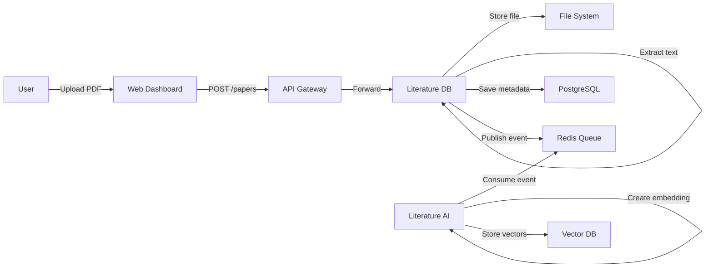
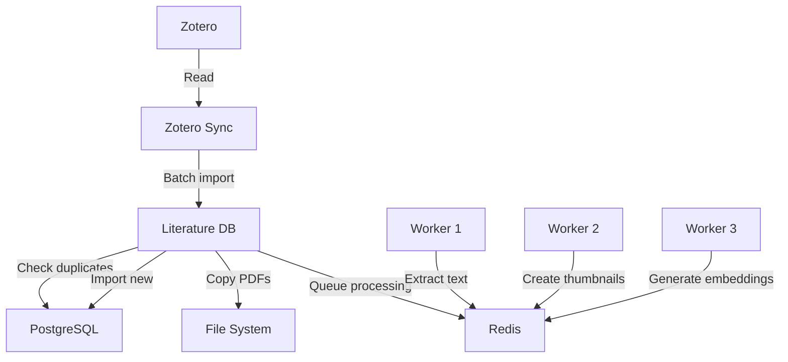
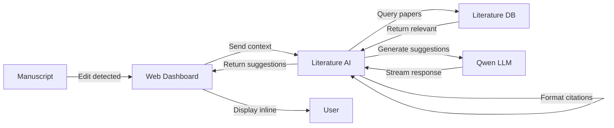
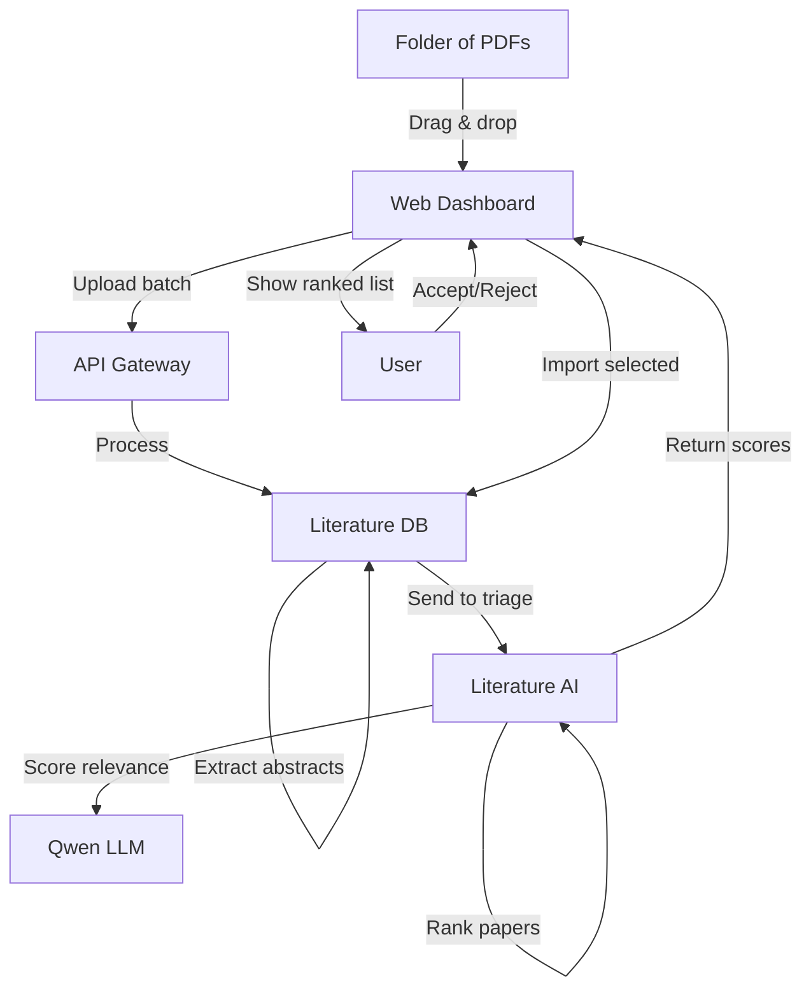
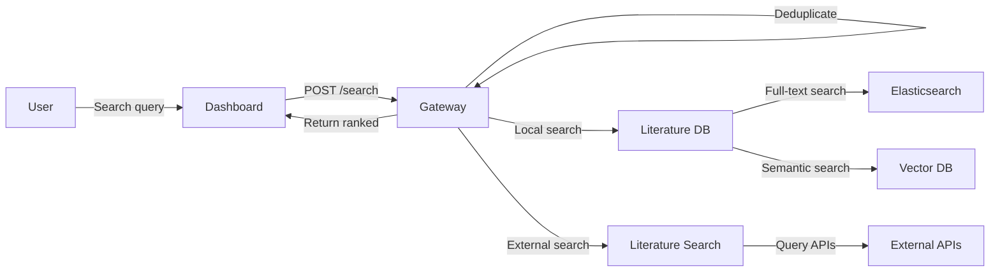
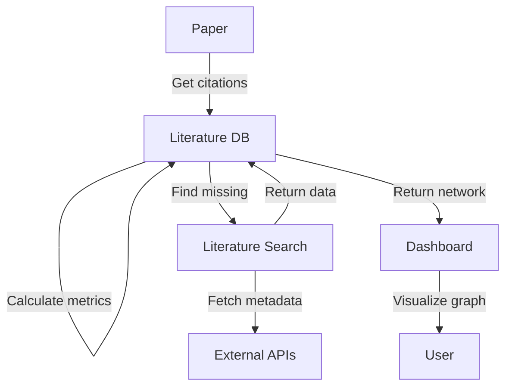

# Data Flow Patterns

## Core Data Flows

### 1. Paper Import Flow (Single)



**Sequence:**
1. User uploads PDF through dashboard
2. File sent to literature-database service
3. PDF stored in `data/pdfs/` with hash-based name
4. Text extracted using pdfplumber
5. Metadata saved to PostgreSQL
6. Event published: "paper_added"
7. AI service creates embeddings asynchronously
8. Search service indexes content

### 2. Bulk Import Flow (Zotero Sync)



**Steps:**
1. Read Zotero database from Windows path
2. Check for existing papers by DOI/title
3. Import new papers in batches
4. Queue background tasks for processing
5. Workers handle extraction/embedding in parallel

### 3. Writing Assistance Flow



**Context Detection:**
```python
{
    "manuscript_text": "Current paragraph...",
    "section": "Discussion",
    "recent_edits": "claim about dopamine",
    "existing_citations": ["Smith2020", "Jones2019"],
    "cursor_position": 1245
}
```

**AI Processing:**
1. Detect what user is writing about
2. Find relevant papers in database
3. Check for missing citations
4. Generate suggestions using LLM
5. Stream back to user in real-time

### 4. Paper Triage Flow



**Scoring Pipeline:**
1. Extract title + abstract from each paper
2. Send batch to AI service
3. LLM scores based on research context
4. Papers ranked 0-10 relevance
5. User reviews and selects
6. Selected papers fully imported

### 5. Search Flow (Multi-source)



**Search Sources:**
- Local database (owned papers)
- Elasticsearch (full-text)
- Vector database (semantic)
- ArXiv API
- Semantic Scholar API
- PubMed API

### 6. Citation Network Flow



## Event-Driven Patterns

### Events Published

| Event | Publisher | Consumers | Payload |
|-------|-----------|-----------|---------|
| `paper.added` | literature-db | ai, search | `{paper_id, title, path}` |
| `paper.updated` | literature-db | ai, search | `{paper_id, changes}` |
| `paper.deleted` | literature-db | ai, search | `{paper_id}` |
| `embedding.created` | literature-ai | search | `{paper_id, vector_id}` |
| `sync.completed` | literature-db | dashboard | `{imported, failed}` |
| `triage.completed` | literature-ai | dashboard | `{job_id, results}` |

### Message Queue Patterns

```python
# Celery task example
@celery.task
def process_pdf(paper_id: int):
    # Extract text
    text = extract_text(paper_id)
    
    # Create embedding
    embedding = create_embedding(text)
    
    # Index for search
    index_paper(paper_id, text)
    
    # Publish completion
    publish_event("processing.complete", paper_id)
```

## Data Storage Locations

### File System
```
data/
├── pdfs/
│   └── {sha256_hash}.pdf      # Original PDFs
├── cache/
│   ├── thumbnails/
│   │   └── {paper_id}.png     # PDF thumbnails
│   └── extracts/
│       └── {paper_id}.txt     # Extracted text
└── exports/
    └── {timestamp}/            # User exports
```

### PostgreSQL Tables
- `papers` - Core metadata
- `authors` - Author information  
- `tags` - User tags
- `collections` - Paper groups
- `notes` - Annotations
- `citations` - Reference links

### Redis Keys
```
# Job queues
celery:queue:default
celery:queue:embeddings
celery:queue:extraction

# Cache
cache:paper:{id}
cache:search:{query_hash}
cache:suggestions:{context_hash}

# Sessions
session:{user_id}
```

### Vector Database
```
# Collections
papers_embeddings
abstract_embeddings
chunk_embeddings

# Metadata
{
  "paper_id": 123,
  "chunk_index": 0,
  "text": "original chunk"
}
```

## Performance Optimizations

### Caching Strategy
1. **Paper metadata**: Cache for 1 hour
2. **Search results**: Cache for 10 minutes
3. **LLM responses**: Cache with context hash
4. **File extracts**: Permanent cache

### Batch Processing
- Import papers in batches of 50
- Create embeddings in batches of 10
- Index for search in batches of 100

### Async Operations
- PDF text extraction
- Embedding generation
- External API calls
- Thumbnail generation

## Error Handling Flows

### Failed PDF Extraction
```
1. Attempt pdfplumber extraction
2. If failed, try PyPDF2
3. If failed, try OCR (optional)
4. If failed, mark as "extraction_failed"
5. Log error with details
6. Continue with other papers
```

### Failed External Search
```
1. Try primary API
2. If failed, try alternative source
3. If all failed, return local results only
4. Log API failures
5. Cache failure to avoid repeated attempts
```

### LLM Out of Memory
```
1. Detect OOM error
2. Unload current model
3. Clear GPU cache
4. Load smaller model (fallback)
5. Retry operation
6. Alert user if still failing
```