# Paper Import & Processing Workflow

## Overview

This document guides Claude agents through the complete paper import and processing pipeline. Use this when helping users add papers to their literature database.

## Quick Reference: Completeness Tiers

| Tier | Fields | How to Advance |
|------|--------|----------------|
| **Minimal** | Title only | `add_paper(title)` |
| **Basic** | + authors, year | `enrich_paper` or manual |
| **Standard** | + DOI/arXiv + abstract | `enrich_paper`, `import_from_external` |
| **Indexed** | + embeddings + FTS | `embed_paper` (auto after text) |
| **Complete** | + full text + validated | `acquire_paper_pdf`, `validate_paper` |

---

## Entry Point Decision Tree

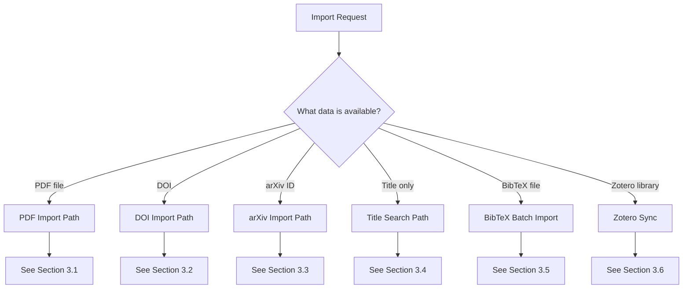

---

## 3. Import Scenarios

### 3.1 PDF File Import

**When to use**: User has a PDF file (downloaded or uploaded)

**Tool sequence**:
```
1. find_duplicates(method="hash")     # Check if PDF already exists
2. add_paper(title="[from PDF]")      # Create paper entry
3. process_downloaded_pdfs()          # Extract text, link PDF
4. enrich_paper(paper_id)             # Fetch metadata by title/DOI
5. embed_paper(paper_id)              # Generate embeddings
```

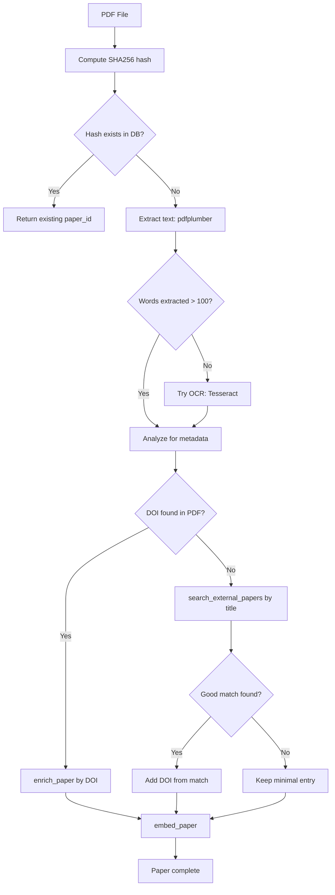

**Example session**:
```
User: I have a PDF at ~/Downloads/paper.pdf

Claude: Let me process this PDF for you.

[calls find_duplicates(method="hash")]
No duplicates found.

[calls add_paper(title="Pending extraction")]
Created paper ID 456.

[calls process_downloaded_pdfs()]
Extracted 8,500 words from PDF.
Found DOI: 10.1021/acs.chemmater.2c01234

[calls enrich_paper(paper_id=456)]
Added metadata: authors, year, abstract, journal.

[calls embed_paper(paper_id=456)]
Generated embeddings.

Paper 456 is now complete with full text and metadata.
```

---

### 3.2 DOI Import

**When to use**: User provides a DOI (e.g., `10.1021/...`)

**Tool sequence**:
```
1. search(query="doi:10.xxx")         # Check if already in DB
2. import_from_external(doi="10.xxx") # Import with metadata
3. find_open_access_pdf(doi="10.xxx") # Try to find PDF
4. acquire_paper_pdf(paper_id)        # Download PDF if found
5. embed_paper(paper_id)              # Generate embeddings
```

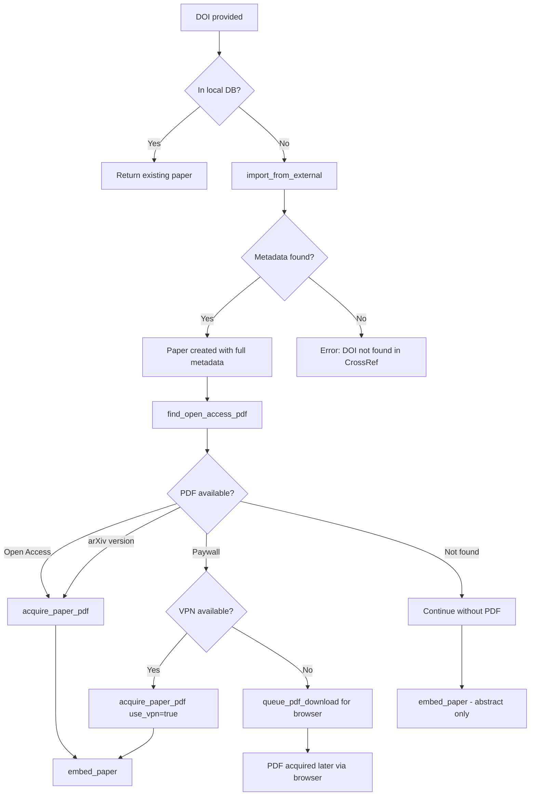

**Example session**:
```
User: Add this paper: 10.1021/acs.chemmater.2c01234

Claude: I'll import this DOI.

[calls search(query="doi:10.1021/acs.chemmater.2c01234")]
Not in library yet.

[calls import_from_external(doi="10.1021/acs.chemmater.2c01234")]
Imported: "Atomic Layer Deposition of..." by Smith et al. (2022)
Paper ID: 457

[calls find_open_access_pdf(doi="10.1021/acs.chemmater.2c01234")]
Found open access version via Unpaywall.

[calls acquire_paper_pdf(paper_id=457)]
Downloaded PDF, extracted 12,000 words.

[calls embed_paper(paper_id=457)]
Paper 457 is now fully indexed and searchable.
```

---

### 3.3 arXiv ID Import

**When to use**: User provides arXiv ID (e.g., `2301.12345`)

**Tool sequence**:
```
1. import_from_external(arxiv_id="2301.xxxxx")  # Import + auto PDF
2. embed_paper(paper_id)                         # Index
```

**Special notes**:
- arXiv PDFs are always open access - no acquisition issues
- Check for published version with DOI (preprints often get published)
- Handle version numbers (v1, v2, etc.)

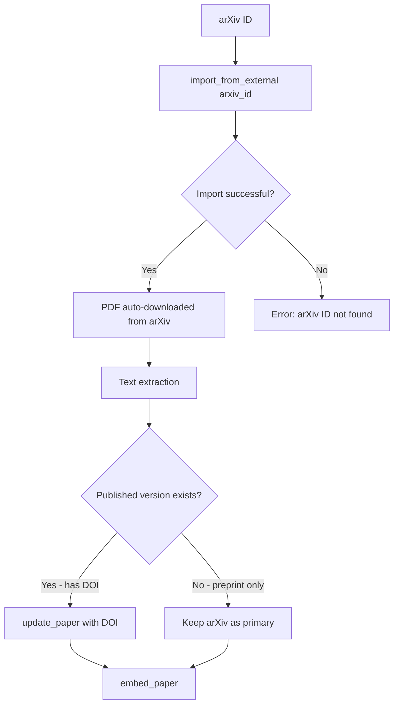

---

### 3.4 Title-Only Import

**When to use**: User only has a paper title

**Tool sequence**:
```
1. find_duplicates(method="title", threshold=0.85)  # Check existing
2. search_external_papers(query="title text")       # Find in external DBs
3. [User selects best match]
4. import_from_external(doi="...")                  # Import selected
5. acquire_paper_pdf(paper_id)                      # Try to get PDF
6. embed_paper(paper_id)                            # Index
```

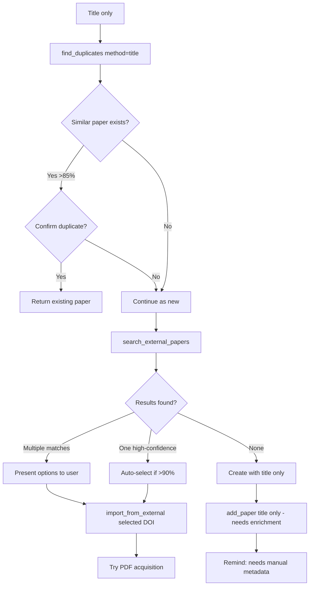

**Example session**:
```
User: Add "Atomic layer deposition of aluminum oxide thin films"

Claude: Let me search for this paper.

[calls find_duplicates(method="title", threshold=0.85)]
No duplicates found.

[calls search_external_papers(query="Atomic layer deposition of aluminum oxide thin films")]
Found 3 matches:
1. (95% match) DOI: 10.1063/1.123456 - George et al. 2010, Chemical Reviews
2. (78% match) DOI: 10.1021/... - Similar title, different paper
3. (72% match) DOI: 10.1016/... - Related work

The first result (George et al. 2010) looks like a strong match. Should I import it?

User: Yes, that's the one.

[calls import_from_external(doi="10.1063/1.123456")]
Imported paper ID 458 with full metadata.
```

---

### 3.5 BibTeX Batch Import

**When to use**: User has a .bib file with multiple entries

**Tool sequence**:
```
1. parse_bib_file(file_path)              # Parse and preview
2. import_bibtex(content, tags=["batch"]) # Import all entries
3. enrich_paper(paper_id) for each        # Fill missing metadata
4. queue_batch_pdf_download(paper_ids)    # Queue PDF downloads
```

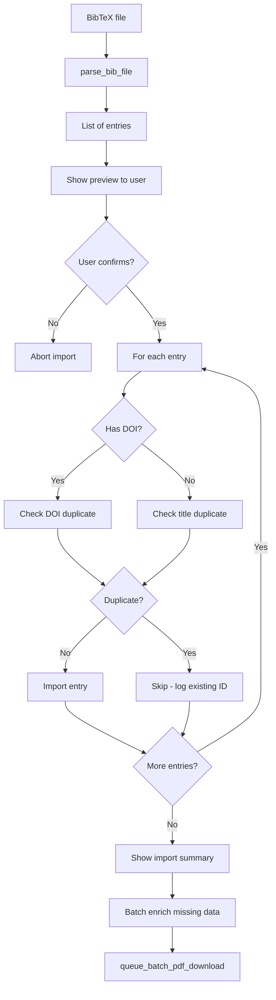

**Example session**:
```
User: Import my bibliography from ~/thesis/references.bib

Claude: Let me parse your BibTeX file.

[calls parse_bib_file(file_path="~/thesis/references.bib")]
Found 45 entries:
- 38 have DOIs
- 7 are title-only

[calls import_bibtex(bibtex_content=..., tags=["thesis"])]
Results:
- Imported: 42
- Skipped (duplicates): 3
- Failed: 0

[calls queue_batch_pdf_download(paper_ids=[...])]
Queued 38 papers for PDF download. Use get_download_queue_status() to monitor.
```

---

### 3.6 Zotero Sync

**When to use**: User wants to sync with their Zotero library

**Tool sequence**:
```
1. check_zotero_connection()        # Verify API access
2. sync_from_zotero()               # Pull papers from Zotero
3. enrich_paper() for new papers    # Fill metadata gaps
4. sync_to_zotero()                 # Push enrichments back (optional)
```

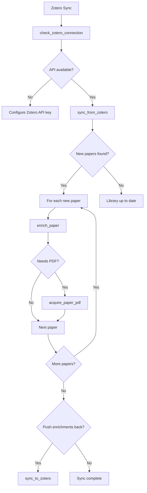

---

## 4. Metadata Enrichment Pipeline

Use `enrich_paper(paper_id)` to automatically fill missing metadata.

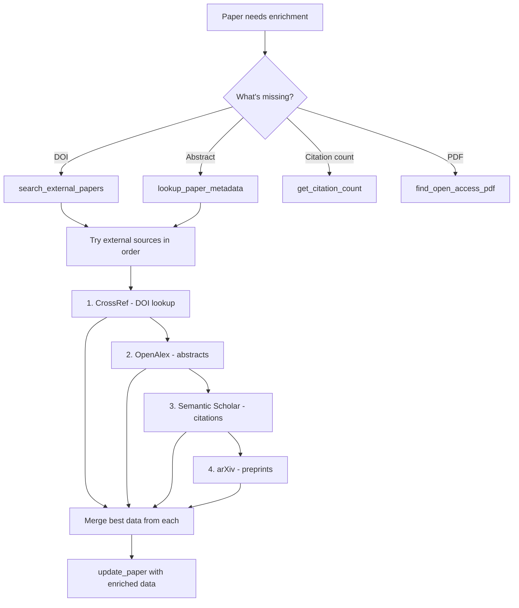

**Source priority**:
| Source | Best for |
|--------|----------|
| CrossRef | DOI validation, core metadata |
| OpenAlex | Abstracts, open access status |
| Semantic Scholar | Citation counts, PDF URLs |
| arXiv | Preprint metadata, always-available PDFs |

---

## 5. Validation & Verification

Use validation to confirm papers exist in external databases.

**Tool sequence**:
```
1. get_validation_status()                    # Check coverage
2. get_validation_queue(prioritize_with_doi=True)  # Get papers to validate
3. validate_paper(paper_id)                   # Verify single paper
4. validate_papers_batch(paper_ids)           # Batch validation
```

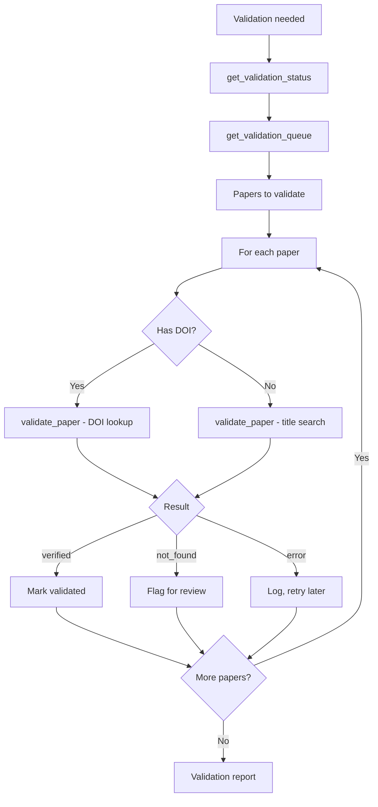

**Confidence thresholds**:
- `>= 0.85`: Verified - high confidence match
- `0.5 - 0.85`: Possible match - manual review
- `< 0.5`: Not found - may be incorrect metadata

---

## 6. PDF Acquisition Strategies

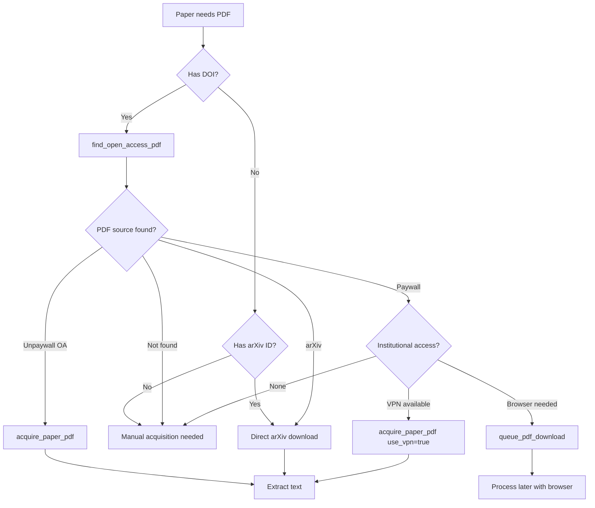

**Acquisition methods**:
| Method | Tool | When to use |
|--------|------|-------------|
| Open Access | `acquire_paper_pdf(paper_id)` | Unpaywall finds OA version |
| arXiv | Auto with `import_from_external(arxiv_id)` | Has arXiv ID |
| VPN | `acquire_paper_pdf(paper_id, use_vpn=True)` | Connected to institutional VPN |
| Browser | `queue_pdf_download(paper_id)` | Need manual browser login |

---

## 7. Text Extraction

### Modern PDFs (Text-based)
- **Tool**: pdfplumber (default)
- **Process**: Page-by-page text extraction
- **Speed**: Fast (~1-2 seconds)

### Scanned PDFs (Image-based)
- **Detection**: Word count < 100 after pdfplumber
- **Tool**: Tesseract OCR (automatic fallback)
- **Process**: Convert to images → OCR each page
- **Speed**: Slow (~30-60 seconds per page)

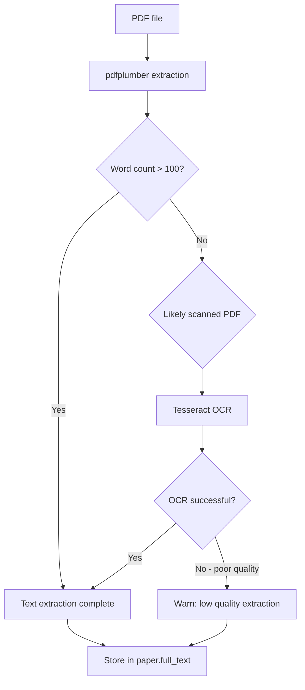

---

## 8. Embedding & Indexing

After text is available, generate embeddings for search.

**Tool**: `embed_paper(paper_id)` or `process_embedding_queue(limit=50)`

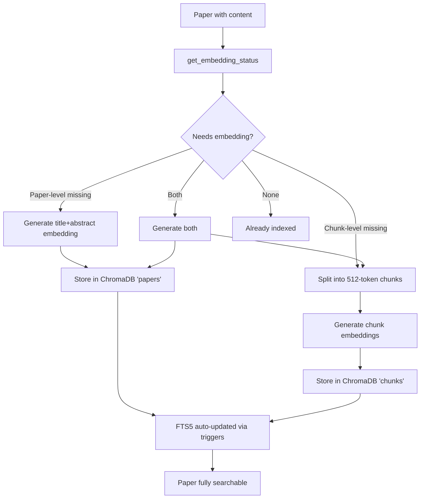

**Two embedding levels**:
| Level | Input | Use case |
|-------|-------|----------|
| Paper-level | Title + abstract | Fast paper discovery |
| Chunk-level | Full text chunks | Deep content search |

---

## 9. Duplicate Detection

Three methods available via `find_duplicates()`:

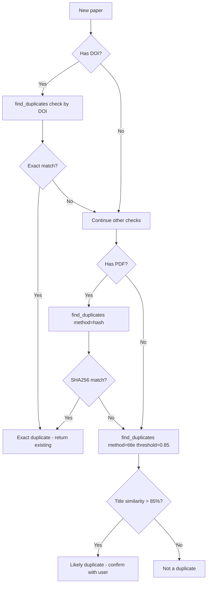

| Method | Confidence | Tool call |
|--------|------------|-----------|
| DOI match | 100% | `find_duplicates(method="doi")` |
| File hash | 100% | `find_duplicates(method="hash")` |
| Title similarity | Variable | `find_duplicates(method="title", threshold=0.85)` |

---

## 10. Data Quality Checks

### Required fields by tier:

| Tier | Required fields |
|------|-----------------|
| Minimal | `title` |
| Basic | + `authors`, `year` |
| Standard | + `doi` OR `arxiv_id`, `abstract` |
| Indexed | + embeddings in ChromaDB |
| Complete | + `full_text`, `validation_status="verified"` |

### Quality issues to watch:
- **Missing abstract**: Run `enrich_paper()` to fetch
- **No PDF**: Check `find_open_access_pdf()`, queue if paywall
- **Unvalidated**: Run `validate_paper()` to verify
- **No embeddings**: Run `embed_paper()` after text available

---

## 11. Completeness Definition

A paper is **complete** when:

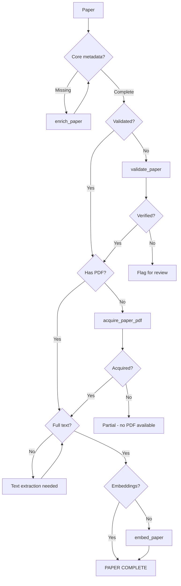

**Completeness checklist**:
- [ ] Title, authors, year present
- [ ] DOI or arXiv ID assigned
- [ ] Abstract available
- [ ] Validated against external DB
- [ ] PDF acquired (if available)
- [ ] Full text extracted
- [ ] Embeddings generated

---

## 12. Error Handling Guide

| Error | Cause | Resolution |
|-------|-------|------------|
| `PAPER_NOT_FOUND` | Invalid paper_id | Verify with `list_papers()` |
| `DUPLICATE_DOI` | Paper already exists | Return existing paper_id |
| `EXTERNAL_API_ERROR` | API rate limit or down | Wait and retry, or try alternative source |
| `PDF_DOWNLOAD_FAILED` | Paywall or network issue | Queue for browser download |
| `TEXT_EXTRACTION_FAILED` | Corrupt PDF or scanned | Try OCR, report if still fails |
| `EMBEDDING_ERROR` | ChromaDB unavailable | Check `get_search_status()` |
| `VALIDATION_ERROR` | Missing required field | Check what's missing, enrich first |

### Recovery workflows:

**API rate limited**:
```
1. Wait 60 seconds
2. Retry with different source (CrossRef → OpenAlex → Semantic Scholar)
3. If all fail, log and continue without that data
```

**PDF not accessible**:
```
1. Check find_open_access_pdf() for alternatives
2. Try queue_pdf_download() for browser acquisition
3. If no options, continue without PDF (abstract-only indexing)
```

**Validation failed**:
```
1. Check if DOI is correct format
2. Try title-based validation
3. If still fails, flag for manual review
```
