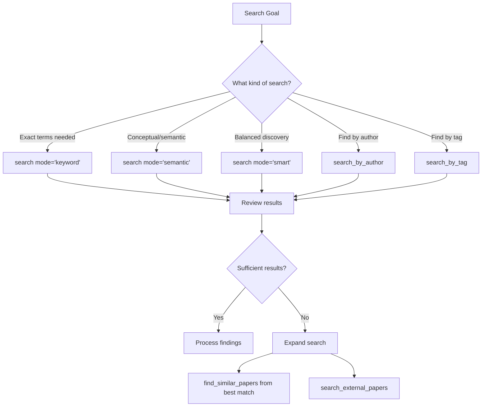
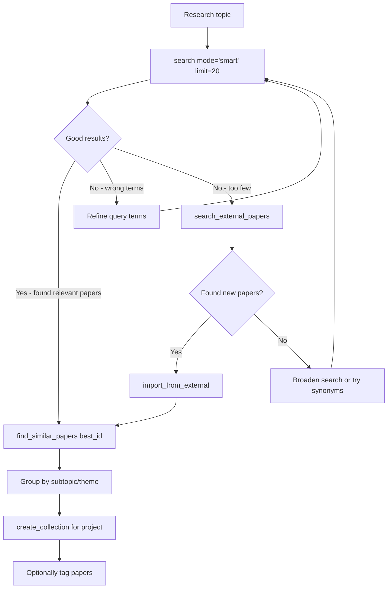
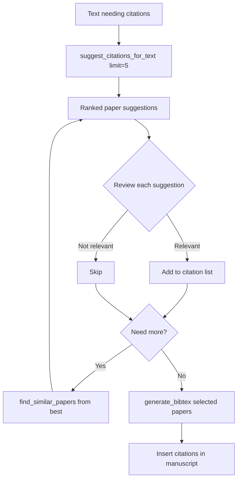
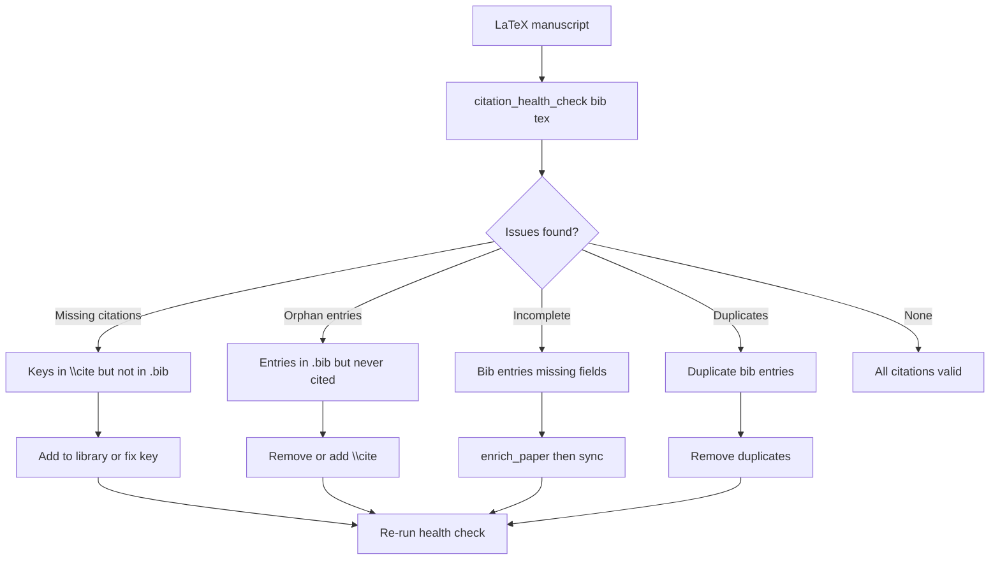
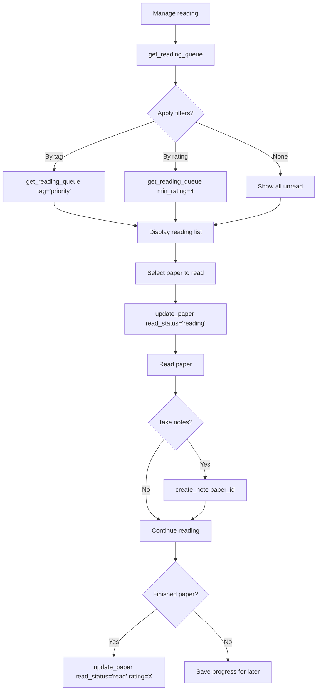
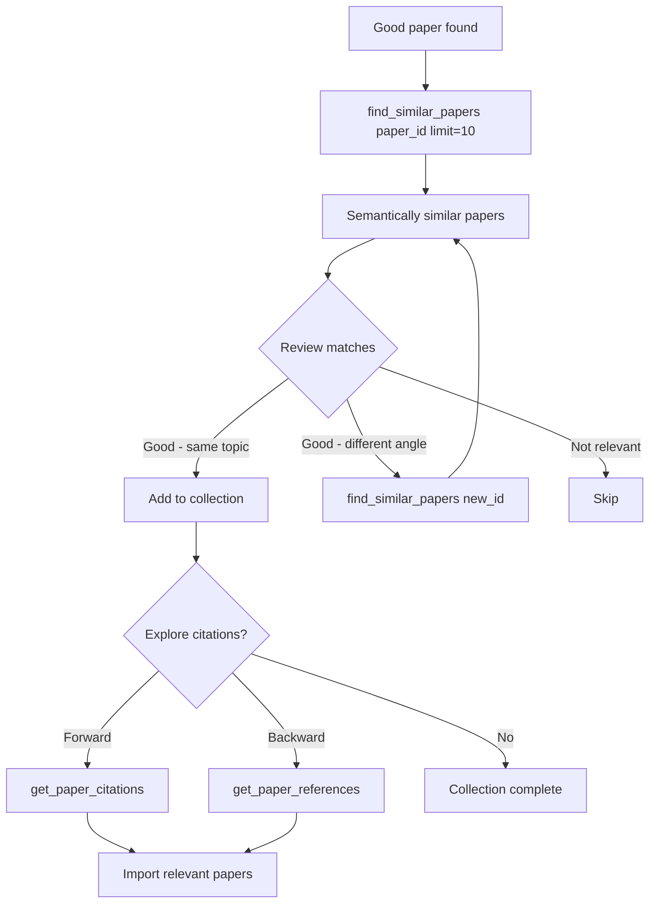
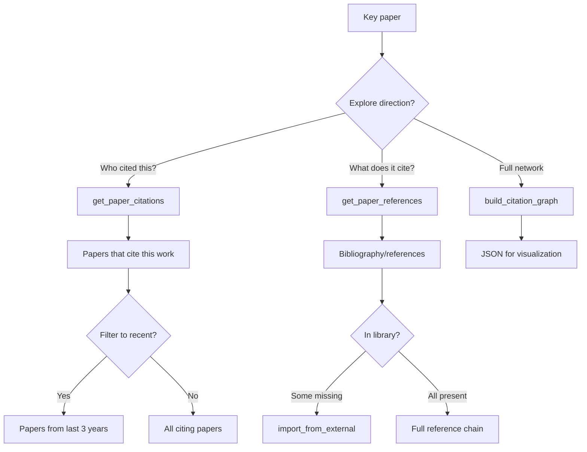
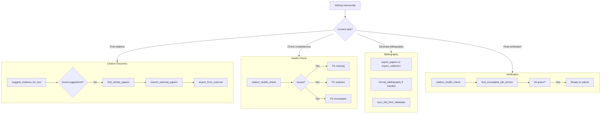

# Research Workflow Guide

## Overview

This document guides Claude agents through research tasks: finding papers, managing citations, exploring literature, and supporting academic writing.

## Quick Reference: Task to Tools

| Research Task | Primary Tools |
|---------------|---------------|
| Find papers on a topic | `search(mode='smart')`, `find_similar_papers` |
| Get citation suggestions | `suggest_citations_for_text` |
| Check manuscript citations | `citation_health_check`, `scan_tex_citations` |
| Build bibliography | `export_papers`, `generate_bibtex` |
| Manage reading queue | `get_reading_queue`, `update_paper` |
| Take notes | `create_note`, `get_paper_notes` |
| Explore citation network | `get_paper_citations`, `get_paper_references` |

---

## 1. Literature Discovery

### Search Mode Selection



### When to use each search mode:

| Mode | Best for | Example |
|------|----------|---------|
| `smart` (default) | Most searches - handles typos, acronyms | "ALD thin films" → expands "ALD" |
| `keyword` | Exact phrase matching | "hafnium oxide" - exact term |
| `semantic` | Conceptual search | "how atoms deposit layer by layer" |
| `hybrid` | Balanced keyword + semantic | Complex research questions |

**Tool signatures**:
```
search(query, mode='smart', limit=20)
search(query, mode='keyword')     # BM25 FTS5
search(query, mode='semantic')    # Embedding similarity
search(query, mode='hybrid', alpha=0.65)  # Weighted combination
```

---

## 2. Finding Papers for a Research Topic

**Recommended workflow**:



**Example session**:
```
User: Find papers about ALD precursor chemistry for my thesis

Claude: I'll search your library for relevant papers.

[calls search(query="ALD precursor chemistry", mode="smart", limit=20)]
Found 15 papers in your library:
1. (0.89) "Precursor Chemistry for Atomic Layer Deposition" - George 2010
2. (0.85) "Metal-organic precursors for ALD" - Ritala 2009
3. (0.82) "Thermal ALD precursor design" - Kim 2015
...

[calls find_similar_papers(paper_id=123)]  # George 2010
Found 8 more related papers not in initial results.

Want me to also search external databases for papers not in your library?

User: Yes please

[calls search_external_papers(query="ALD precursor chemistry")]
Found 5 relevant papers not in your library:
1. DOI: 10.1021/... "New precursor synthesis" (2023)
2. DOI: 10.1016/... "Precursor screening study" (2022)

Should I import these?
```

---

## 3. Citation Management

### 3.1 Suggesting Citations for Text

**When to use**: Writing a paragraph that needs supporting citations.



**Tool signature**:
```
suggest_citations_for_text(
    text="Your paragraph text here",
    limit=5,
    include_bibtex=True  # Include BibTeX entries
)
```

**Example session**:
```
User: Suggest citations for this paragraph:
"Atomic layer deposition enables precise thickness control at the atomic level,
making it ideal for semiconductor manufacturing applications."

Claude: Let me find relevant papers from your library.

[calls suggest_citations_for_text(text="...", limit=5)]
Top suggestions:
1. (0.91) George 2010 - "Atomic Layer Deposition: An Overview"
   Key: george2010atomic

2. (0.87) Ritala 2009 - "Industrial applications of atomic layer deposition"
   Key: ritala2009industrial

3. (0.84) Leskelä 2002 - "Atomic layer deposition: from precursors to thin films"
   Key: leskela2002atomic

I recommend citing [1] for the general ALD principle and [2] for the semiconductor
application angle. Want me to generate BibTeX for these?
```

### 3.2 Checking Manuscript Citations

**When to use**: Verifying all citations in a LaTeX manuscript are valid.



**Tool sequence**:
```
1. set_project_config(project_path, bib_files, tex_paths)
2. citation_health_check(bib_path, tex_path)
3. [Fix issues as identified]
4. sync_bib_from_database(bib_path, dry_run=True)  # Preview
5. sync_bib_from_database(bib_path, dry_run=False) # Apply
```

**Example session**:
```
User: Check citations in my thesis chapter

Claude: I'll analyze your manuscript citations.

[calls citation_health_check(bib_path="thesis.bib", tex_path="chapter3.tex")]

Citation Health Report:
- Total citations in tex: 42
- Total bib entries: 55
- Missing (cited but not in bib): 2
  - \cite{smith2023new} - not found
  - \cite{jones_review} - not found
- Orphan (in bib but not cited): 13
- Incomplete entries: 3 (missing abstracts)

Recommendations:
1. Add missing citations or fix typos in keys
2. Review orphan entries - remove if not needed
3. Run enrich_paper for incomplete entries

Should I help fix these issues?
```

---

## 4. Building Bibliographies

### Export by paper IDs:
```
export_papers(paper_ids=[1,2,3], format='bibtex')
```

### Export by tag:
```
export_papers(tag='thesis-ch3', format='bibtex')
```

### Export collection:
```
export_collection(collection_id=5, format='bibtex', include_subcollections=True)
```

### Generate formatted bibliography:
```
format_bibliography(papers, style='apa')  # or 'mla', 'chicago', 'bibtex'
```

**Example session**:
```
User: Generate bibliography for my methods section

Claude: I'll export papers tagged for your methods section.

[calls search_by_tag(tag="methods")]
Found 12 papers tagged "methods".

[calls export_papers(paper_ids=[...], format='bibtex')]

@article{george2010atomic,
  author = {Steven M. George},
  title = {Atomic Layer Deposition: An Overview},
  journal = {Chemical Reviews},
  year = {2010},
  ...
}
...

Would you like me to save this to a file or format it in a different style?
```

---

## 5. Reading Queue Management



**Tool sequence**:
```
1. get_reading_queue(limit=20)                    # View unread
2. update_paper(paper_id, read_status='reading')  # Start reading
3. create_note(paper_id, content, note_type)      # Take notes
4. update_paper(paper_id, read_status='read', rating=4)  # Complete
```

**Read status values**: `unread`, `reading`, `read`

**Example session**:
```
User: What should I read next?

Claude: Let me check your reading queue.

[calls get_reading_queue(limit=10, min_rating=4)]

Your high-priority unread papers:
1. (Rating: 5) "Advanced ALD Precursors" - Added 2 days ago
2. (Rating: 4) "Thin Film Characterization" - Added 1 week ago
3. (Rating: 4) "Process Optimization" - Added 2 weeks ago

Shall I mark one as "reading" to track your progress?

User: Start the first one

[calls update_paper(paper_id=123, read_status='reading')]
Marked "Advanced ALD Precursors" as currently reading.
```

---

## 6. Note-Taking on Papers

### Note types:
| Type | Use for |
|------|---------|
| `highlight` | Key passages, important quotes |
| `comment` | Your thoughts, reactions |
| `summary` | Paper summary |

**Tool signatures**:
```
create_note(paper_id, content, note_type='comment', page_number=None)
get_paper_notes(paper_id, note_type=None)
list_notes(note_type='summary')  # Find all summaries
update_note(note_id, content)
delete_note(note_id)
```

**Example session**:
```
User: Save a note about the key finding on page 5

Claude: [calls create_note(
    paper_id=123,
    content="Key finding: Growth rate of 1.1 Å/cycle achieved with new precursor",
    note_type='highlight',
    page_number=5
)]

Note saved. You now have 3 notes on this paper.

User: Show all my notes on this paper

[calls get_paper_notes(paper_id=123)]

Notes for "Advanced ALD Precursors":
1. [Highlight, p.5] "Key finding: Growth rate of 1.1 Å/cycle..."
2. [Comment, p.12] "Compare this with Kim 2015 results"
3. [Summary] "Review of precursor design principles..."
```

---

## 7. Finding Similar Papers



**Tools**:
```
find_similar_papers(paper_id, limit=10, min_similarity=0.5)
find_papers_like_text(text="description of what you need")
find_common_references(paper_id)  # Papers that cite same sources
```

**Example session**:
```
User: Find papers similar to the George 2010 review

Claude: [calls find_similar_papers(paper_id=42, limit=10)]

Papers similar to "Atomic Layer Deposition: An Overview":
1. (0.89) Ritala 2009 - "Industrial applications of ALD" [in library]
2. (0.85) Leskelä 2002 - "ALD chemistry and mechanisms" [in library]
3. (0.82) Puurunen 2005 - "Surface chemistry of ALD" [in library]
4. (0.78) Miikkulainen 2013 - "Crystallinity in ALD" [NOT in library]

Paper #4 looks relevant but isn't in your library. Should I search for it externally?
```

---

## 8. Citation Network Exploration



**Tools**:
```
get_paper_citations(paper_id)       # Who cites this paper
get_paper_references(paper_id)      # What this paper cites
find_common_references(paper_id)    # Papers citing same sources
build_citation_graph(paper_ids, depth=1)  # Network visualization
```

**Example session**:
```
User: Show me who cited the George 2010 review

Claude: [calls get_paper_citations(paper_id=42)]

Papers citing "Atomic Layer Deposition: An Overview" (George 2010):
Total citations: 4,523 (via Semantic Scholar)

Recent citations (2022-2024):
1. "Next-generation ALD reactors" - Chen 2024, Nature Electronics
2. "Quantum device fabrication via ALD" - Park 2023, Science
3. "AI-guided process optimization" - Miller 2023, ACS Nano
...

[calls find_common_references(paper_id=42)]
Papers in your library that cite the same foundational works:
- 5 papers also cite Leskelä 2002
- 4 papers also cite Ritala 2009
- 3 papers also cite Suntola 1992 (original ALD patent)
```

---

## 9. Manuscript Support Workflow

Complete workflow for thesis/paper writing:



**Complete tool sequence**:
```
# Setup project
1. set_project_config(project_path, bib_files=["thesis.bib"], tex_paths=["chapters/"])

# During writing - find citations
2. suggest_citations_for_text(text="paragraph needing citation")
3. import_from_external(doi) for papers not in library

# Check health periodically
4. citation_health_check(bib_path, tex_path)
5. [Fix any issues]

# Generate/update bibliography
6. sync_bib_from_database(bib_path, dry_run=True)  # Preview
7. sync_bib_from_database(bib_path, dry_run=False) # Apply

# Final verification
8. citation_health_check(bib_path, tex_path)  # Should be clean
9. find_incomplete_bib_entries(bib_path)      # Should be empty
```

**Example session**:
```
User: Help me prepare my thesis for submission

Claude: I'll run a complete citation health check.

[calls citation_health_check(bib_path="thesis.bib", tex_path="chapters/")]

Citation Health Report:
- Total \cite{} commands: 127
- Total bib entries: 145
- Missing citations: 0
- Orphan entries: 18 (in bib but not cited)
- Incomplete entries: 5 (missing DOIs)
- Duplicate entries: 2

[calls find_incomplete_bib_entries(bib_path="thesis.bib")]
Entries missing required fields:
1. smith2020: missing DOI
2. johnson2019: missing year
...

Recommendations:
1. Review 18 orphan entries - remove if not needed
2. Add DOIs to 5 entries using enrich_paper
3. Remove 2 duplicate entries

Should I help fix these issues?
```

---

## Error Handling

| Error | Cause | Resolution |
|-------|-------|------------|
| `SEARCH_NO_RESULTS` | Query too specific | Broaden terms, try synonyms |
| `EXTERNAL_SEARCH_FAILED` | API unavailable | Retry later, try different source |
| `CITATION_KEY_MISMATCH` | Typo in \cite{} | Check exact key spelling |
| `PAPER_NOT_IN_LIBRARY` | Reference not imported | Use import_from_external |
| `BIB_PARSE_ERROR` | Malformed BibTeX | Check syntax, escape special chars |

### Common issues:

**Search returns wrong results**:
```
1. Try different search mode (keyword vs semantic)
2. Use more specific terms
3. Search by author instead: search_by_author("Smith")
4. Check if paper uses different terminology
```

**Citation key not found**:
```
1. List papers to find correct key: list_papers(title="partial title")
2. Check for typos in citation key
3. Re-import paper with correct key: suggest_citation_key(title, authors)
```

**External search fails**:
```
1. Check API status: get_search_status(detailed=True)
2. Wait 60 seconds for rate limits
3. Try alternative source (CrossRef → OpenAlex → Semantic Scholar)
```
